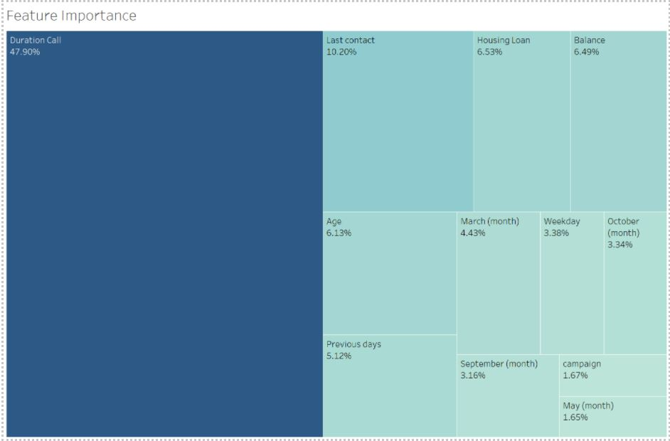
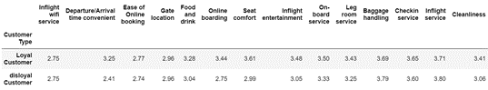
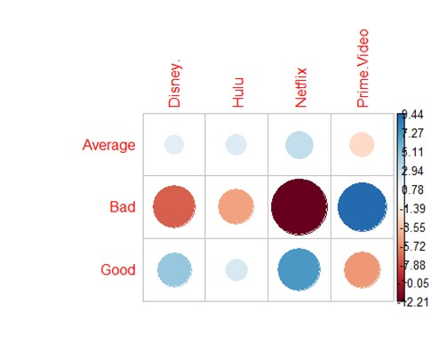
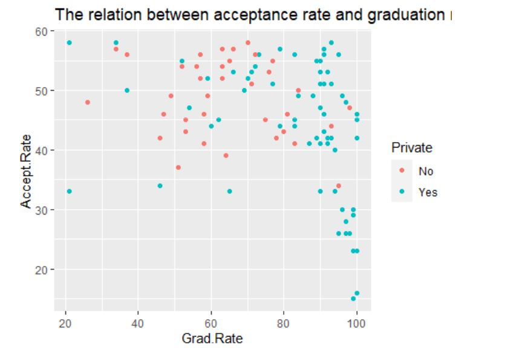
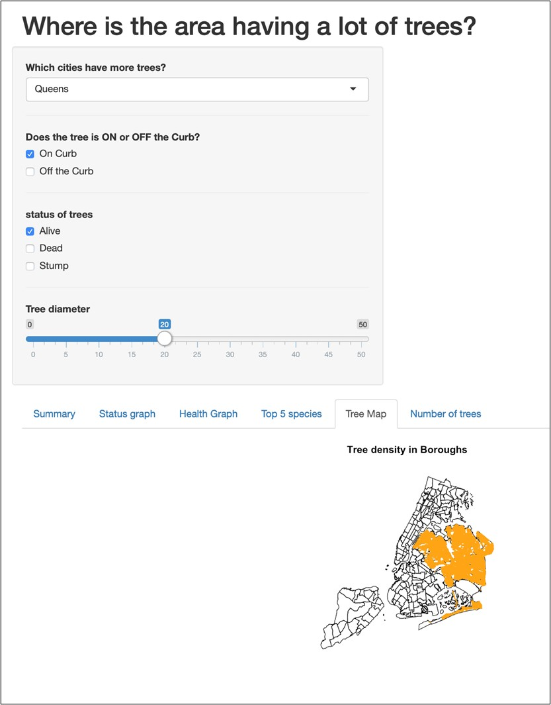
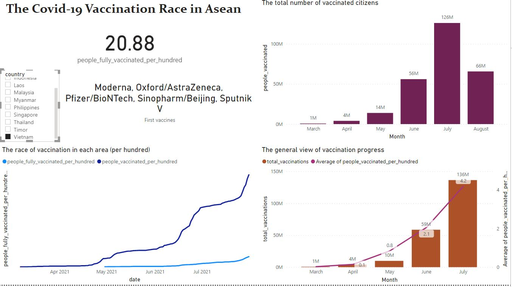

## **Portfolio**

---

### Python
[Bank's Marketing Campaign Prediction](pdf/Presentation.pdf)

---
[US Airline Passenger's Satisfaction Research](pdf/The analysis of passenger satisfaction with python.pdf)

---
### R
[Movie Streaming Platform Analysis - Pearson's Chi-squared test Application](pdf/movieplatformanalysis-Crewgroup-NamHoPhan.pdf)

---
[University Evaluation - GLM & Logistic Regression for predictive modeling](pdf/UniversityEvaluationwGLM&LogisticRegression.pdf)

---
[New York Tree Plant Project - Design interactive web app for end-users](http://127.0.0.1:6437/)

---
### Tableau

---
### PowerBI

[Analysis of the Covid-19 vaccination race in Asean from 03/2021 to 08/2021](/vaccination)

---
### Topics of Predictive Model

- [Decision Tree](pdf/HW1-NamHoPhan-ALY6020.pdf)
- [KNN](pdf/HW1-NamHoPhan-ALY6020.pdf)

---

### Experience Sharing
- [How to use Azure Machine Learning Studio to create a model](pdf/EAI6010_PhanNamHoHW5.pdf)
- [How to use neo4j to visualize real-time data](pdf/EAI6010_PhanNamHoHW4.pdf)

---

Page template forked from <a href="https://github.com/evanca/quick-portfolio">evanca</a>

<!-- Remove above link if you don't want to attibute -->
