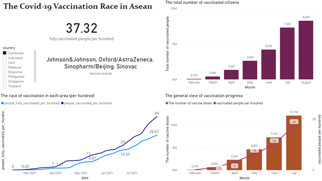

## **Portfolio**

---

### Python
[Bank's Marketing Campaign Prediction](pdf/Presentation.pdf)

---
[US Airline Passenger's Satisfaction Research](pdf/The analysis of passenger satisfaction with python.pdf)
- [Coding Script](https://github.com/nickhophan/Airline-Customer-Satisfaction-analysis.git)

---
### R
[Movie Streaming Platform Analysis - Pearson's Chi-squared test Application](pdf/movieplatformanalysis-Crewgroup-NamHoPhan.pdf)

---
[University Evaluation - GLM & Logistic Regression for predictive modeling](pdf/UniversityEvaluationwGLM&LogisticRegression.pdf)

---
[New York Tree Plant Project - Design interactive web app for end-users](pdf/RshinyTree.pdf)

---
### Tableau
[Tree and Citizen Dashboard](pdf/Tree and Citizen - DASHBOARD DESCRIPTION.pdf)

---
### PowerBI

[Dashboard of the Covid-19 vaccination race in Asean from 03/2021 to 08/2021](https://app.powerbi.com/links/90Ypi-wP7A?ctid=a8eec281-aaa3-4dae-ac9b-9a398b9215e7&pbi_source=linkShare)

---
### Topics of Statistical Modeling

- [Decision Tree](pdf/HW1-NamHoPhan-ALY6020.pdf)
- [KNN](pdf/HW1-NamHoPhan-ALY6020.pdf)
- [Hypothesis testing](pdf/assignment5-%20NamHoPhan%20-%201910.pdf) 
- [Regularization](pdf/Assignment4-%20Nam%20Ho%20Phan.pdf)

---
### Experience Sharing
- [How to use Azure Machine Learning Studio to create a model](pdf/EAI6010_PhanNamHoHW5.pdf)
- [How to use neo4j to visualize real-time data](pdf/EAI6010_PhanNamHoHW4.pdf)

---

Page template forked from <a href="https://github.com/evanca/quick-portfolio">evanca</a>

<!-- Remove above link if you don't want to attibute -->
